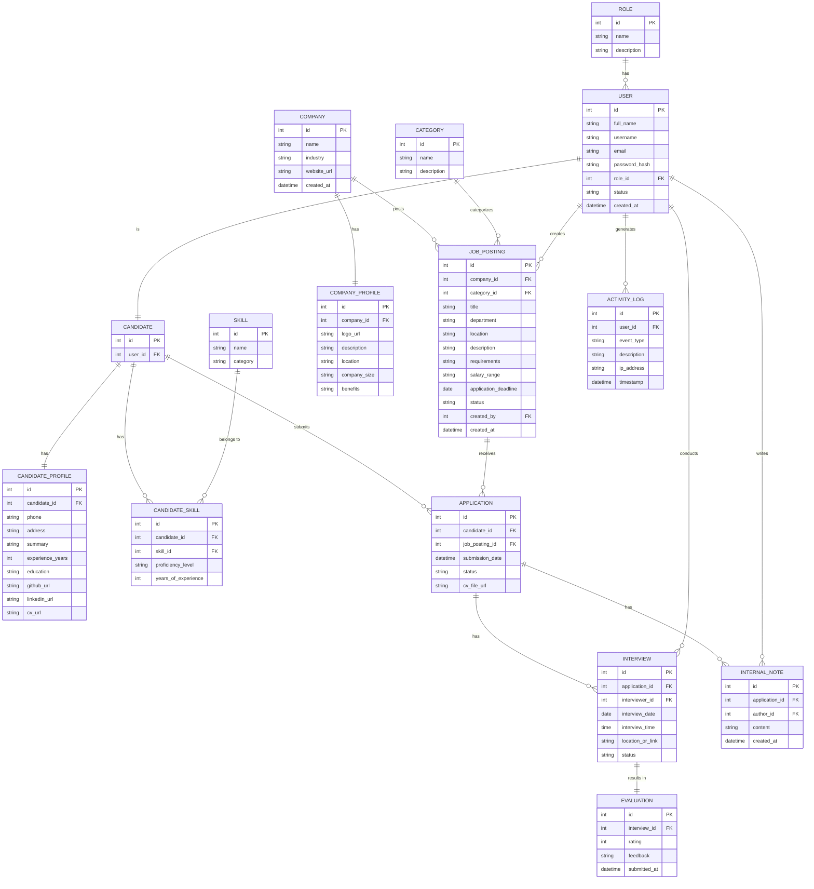

```mermaid
erDiagram
    ROLE {
        int id PK
        string name
        string description
    }
    USER {
        int id PK
        string full_name
        string username
        string email
        string password_hash
        int role_id FK
        string status
        datetime created_at
    }
    CANDIDATE {
        int id PK
        int user_id FK
    }
    CANDIDATE_PROFILE {
        int id PK
        int candidate_id FK
        string phone
        string address
        string summary
        int experience_years
        string education
        string github_url
        string linkedin_url
        string cv_url
    }
    SKILL {
        int id PK
        string name
        string category
    }
    CANDIDATE_SKILL {
        int id PK
        int candidate_id FK
        int skill_id FK
        string proficiency_level
        int years_of_experience
    }
    COMPANY {
        int id PK
        string name
        string industry
        string website_url
        datetime created_at
    }
    COMPANY_PROFILE {
        int id PK
        int company_id FK
        string logo_url
        string description
        string location
        string company_size
        string benefits
    }
    CATEGORY {
        int id PK
        string name
        string description
    }
    JOB_POSTING {
        int id PK
        int company_id FK
        int category_id FK
        string title
        string department
        string location
        string description
        string requirements
        string salary_range
        date application_deadline
        string status
        int created_by FK
        datetime created_at
    }
    APPLICATION {
        int id PK
        int candidate_id FK
        int job_posting_id FK
        datetime submission_date
        string status
        string cv_file_url
    }
    INTERVIEW {
        int id PK
        int application_id FK
        int interviewer_id FK
        date interview_date
        time interview_time
        string location_or_link
        string status
    }
    EVALUATION {
        int id PK
        int interview_id FK
        int rating
        string feedback
        datetime submitted_at
    }
    INTERNAL_NOTE {
        int id PK
        int application_id FK
        int author_id FK
        string content
        datetime created_at
    }
    ACTIVITY_LOG {
        int id PK
        int user_id FK
        string event_type
        string description
        string ip_address
        datetime timestamp
    }

    ROLE ||--o{ USER : "has"
    USER ||--|| CANDIDATE : "is"
    CANDIDATE ||--|| CANDIDATE_PROFILE : "has"
    CANDIDATE ||--o{ CANDIDATE_SKILL : "has"
    SKILL ||--o{ CANDIDATE_SKILL : "belongs to"
    COMPANY ||--|| COMPANY_PROFILE : "has"
    COMPANY ||--o{ JOB_POSTING : "posts"
    CATEGORY ||--o{ JOB_POSTING : "categorizes"
    USER ||--o{ JOB_POSTING : "creates"
    CANDIDATE ||--o{ APPLICATION : "submits"
    JOB_POSTING ||--o{ APPLICATION : "receives"
    APPLICATION ||--o{ INTERVIEW : "has"
    USER ||--o{ INTERVIEW : "conducts"
    INTERVIEW ||--|| EVALUATION : "results in"
    APPLICATION ||--o{ INTERNAL_NOTE : "has"
    USER ||--o{ INTERNAL_NOTE : "writes"
    USER ||--o{ ACTIVITY_LOG : "generates"
```
